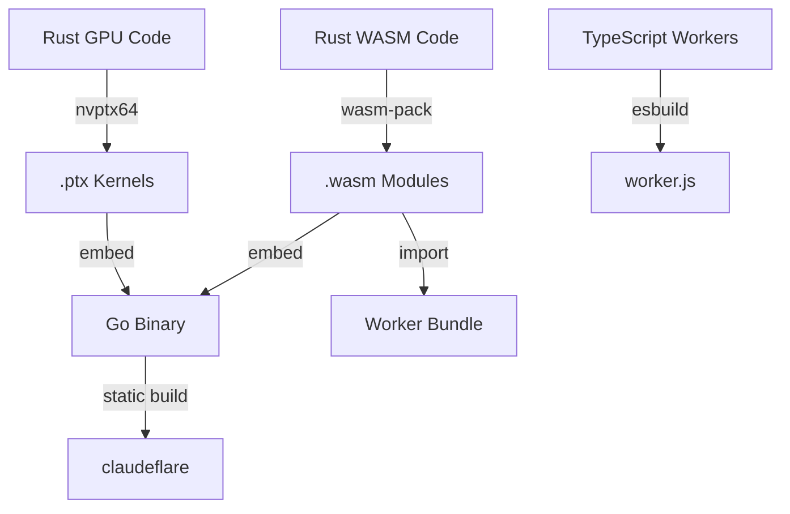

# Language Choice: The Pragmatic Polyglot

## Overview

ClaudeFlare uses a **tri-language architecture** optimized for each layer of the stack. Each language was selected based on its strengths for specific use cases.

## Table of Contents

- [Language Selection Matrix](#language-selection-matrix)
- [Go: Core System Language](#go-core-system-language)
- [TypeScript: Cloudflare Layer Only](#typescript-cloudflare-layer-only)
- [Rust: Performance-Critical Modules](#rust-performance-critical-modules)
- [Hybrid Compilation Pipeline](#hybrid-compilation-pipeline)
- [Decision Rationale](#decision-rationale)

---

## Language Selection Matrix

| Component | Language | Rationale |
|-----------|----------|-----------|
| **Desktop Service** | Go | Concurrency, FFI, static binaries |
| **Cloudflare Workers** | TypeScript | Runtime requirement, tree-shaking |
| **GPU Kernels** | Rust | CUDA/ROCm, memory safety |
| **Hot Path Algorithms** | Rust → WASM | Performance in Workers |
| **Mobile Bridge** | Go (gomobile) | iOS/Android bindings |
| **Frontend** | TypeScript | React, Monaco editor |

---

## Go: Core System Language

### Why Go for Desktop Service

#### 1. CGO & FFI Capabilities

Go provides direct access to CUDA/ROCm through CGO:

```go
/*
#cgo LDFLAGS: -L./lib -lcuda-runtime
#cgo CFLAGS: -I./include -DCUDA_ENABLED

#include <cuda.h>
#include <cuda_runtime.h>

extern void* launch_embedding_kernel(float* input, int size, CUdeviceptr* output);
*/
import "C"
import "unsafe"

// Direct CUDA memory allocation without overhead
func AllocateGPUMemory(size uint64) (unsafe.Pointer, error) {
    var ptr C.CUdeviceptr
    result := C.cudaMalloc(&ptr, C.size_t(size))
    if result != C.CUDA_SUCCESS {
        return nil, fmt.Errorf("CUDA malloc failed")
    }
    return unsafe.Pointer(ptr), nil
}
```

#### 2. Goroutines for Agent Multiplexing

```go
// Handle 10,000+ concurrent agent operations
type AgentScheduler struct {
    agentQueue chan AgentTask
    semaphore  chan struct{} // Limit concurrent GPU ops
}

func (s *AgentScheduler) worker() {
    for task := range s.agentQueue {
        s.semaphore <- struct{}{} // Acquire GPU slot
        go func(t AgentTask) {
            defer func() { <-s.semaphore }()
            s.executeWithGPU(t)
        }(task)
    }
}
```

#### 3. Cross-Compilation

```bash
# Build for all platforms from Linux
GOOS=windows GOARCH=amd64 go build -o claudeflare.exe
GOOS=darwin GOARCH=arm64 go build -o claudeflare-arm64
GOOS=linux GOARCH=amd64 go build -o claudeflare
```

#### 4. Static Binary Distribution

- **Single ~20MB executable** with embedded WASM modules
- **No runtime dependencies**
- **Tiny memory footprint** compared to Java/Node

#### 5. Predictable Garbage Collection

```go
// GC pauses <100us vs Node's 10-50ms stop-the-world
var bufferPool = sync.Pool{
    New: func() interface{} {
        return make([]byte, 0, 1024*1024) // 1MB buffers
    },
}
```

---

## TypeScript: Cloudflare Layer Only

### Why TypeScript is Non-Negotiable

Cloudflare Workers run on **V8 isolates** which only support:
- JavaScript (ES2022+)
- TypeScript (compiled to JS)
- WebAssembly (WASM)

Native modules (Go, Rust binaries) are **not supported**.

### Tree-Shaking for 3MB Limit

```typescript
// esbuild config
await esbuild.build({
    entryPoints: ['src/index.ts'],
    bundle: true,
    minify: true,
    treeShaking: true,
    define: {
        'process.env.NODE_ENV': '"production"',
    },
    external: ['@cloudflare/workers-types'],
});
```

### WASM Bridge for Hot Paths

```typescript
// Compile Rust to WASM for 50x speedup
import init, { similarity_search } from './hnsw_wasm_bg.wasm';

async function searchVectors(query: Float32Array, topK: number) {
    const module = await init();
    return module.similarity_search(query, topK);
}
```

---

## Rust: Performance-Critical Modules

### Why Rust for GPU Operations

#### 1. CUDA Kernel Development

```rust
// src/kernels/attention.rs
use cudarc::driver::{CudaDevice, CudaFunction};

pub fn launch_attention_kernel(
    device: &CudaDevice,
    config: &AttentionConfig,
    input: &f32,
    output: &mut f32,
) -> Result<(), Box<dyn std::error::Error>> {
    let func: CudaFunction = device.load_func("attention_kernel")?;

    unsafe {
        func.launch(
            config,
            ((config.seq_len + 31) / 32, config.num_heads, 1),
            (32, 1, 1),
            (input.as_ptr(), output.as_mut_ptr()),
        )?;
    }

    Ok(())
}
```

#### 2. Zero-Copy Memory Management

```rust
pub fn deserialize_from_gpu(ptr: *const f32, len: usize) -> EmbeddingResult {
    unsafe {
        let slice = std::slice::from_raw_parts(ptr, len);
        bincode::deserialize(slice).unwrap()
    }
}
```

#### 3. FFI: C ABI for Go

```rust
#[no_mangle]
pub extern "C" fn process_embeddings(
    input_ptr: *const f32,
    input_len: usize,
    output_ptr: *mut f32,
    output_len: usize,
) -> i32 {
    // Process embeddings
    0 // Success
}
```

#### 4. Compile to WASM for Workers

```rust
#[wasm_bindgen]
pub fn cosine_similarity(a: &[f32], b: &[f32]) -> f32 {
    let dot: f32 = a.iter().zip(b.iter()).map(|(x, y)| x * y).sum();
    let norm_a: f32 = a.iter().map(|x| x * x).sum::<f32>().sqrt();
    let norm_b: f32 = b.iter().map(|x| x * x).sum::<f32>().sqrt();
    dot / (norm_a * norm_b)
}
```

---

## Hybrid Compilation Pipeline



### Build Script

```bash
#!/bin/bash
# build.sh

echo "Building Rust GPU kernels..."
cd rust-gpu
rustc --crate-type staticlib kernels/*.rs
cd ..

echo "Building Rust WASM modules..."
cd rust-wasm
wasm-pack build --target web --release
cd ..

echo "Building Go desktop service..."
cd cmd/desktop
go build -ldflags="-s -w" -o ../../bin/claudeflare
cd ../..

echo "Building TypeScript Workers..."
cd workers
npm run build
cd ..

echo "Build complete!"
```

---

## Decision Rationale

### Memory Management Comparison

| Language | GC Pause Time | Memory Control | Zero-Copy I/O |
|----------|---------------|----------------|---------------|
| Go | <100μs | Good | syscall/splice |
| TypeScript | 10-50ms | Poor | No |
| Rust | N/A (RAII) | Excellent | Yes |

### Concurrency Model Comparison

| Language | Concurrency | CPU Affinity | Multi-Platform |
|----------|-------------|--------------|----------------|
| Go | Goroutines | LockOSThread | Excellent |
| TypeScript | async/await | No | V8 only |
| Rust | async/await | Yes | Good |

### Platform Support Matrix

| Platform | Go | TypeScript | Rust |
|----------|-----|------------|------|
| Windows | ✅ | ❌ | ✅ |
| Linux | ✅ | ✅ | ✅ |
| macOS | ✅ | ✅ | ✅ |
| Android | ✅ (gomobile) | ❌ | ✅ (JNI) |
| iOS | ✅ (gomobile) | ❌ | ✅ (Swift) |
| WebAssembly | ❌ | ✅ | ✅ |
| Cloudflare Workers | ❌ | ✅ | ✅ |

---

## Summary

The **tri-language architecture** maximizes each language's strengths:

| Layer | Language | Why |
|-------|----------|-----|
| Desktop Service | Go | FFI, concurrency, static binaries |
| Cloudflare Workers | TypeScript | Runtime requirement, WASM bridge |
| GPU Kernels | Rust | CUDA/ROCm, memory safety, zero-cost abstractions |
| Hot Paths | Rust → WASM | 50x speedup in Workers |

**Key Benefits:**
- Go provides the foundation with excellent concurrency and FFI
- TypeScript is mandatory for Cloudflare Workers
- Rust delivers performance where it matters most

---

## Project Structure

```
claudeflare/
├── cmd/
│   └── desktop-proxy/          # Go desktop service
│       └── main.go
├── internal/
│   ├── gpu/                    # Go + CUDA bindings
│   ├── webrtc/                 # WebRTC signaling
│   └── scheduler/              # Agent orchestration
├── rust-gpu/                   # CUDA kernels
│   ├── kernels/
│   └── Cargo.toml
├── rust-wasm/                  # WASM modules
│   ├── src/
│   └── Cargo.toml
├── workers/
│   ├── src/                    # TypeScript agent definitions
│   ├── wasm/                   # Compiled Rust WASM
│   └── package.json
└── mobile/
    ├── ios/                    # React Native iOS
    └── android/                # React Native Android
```
